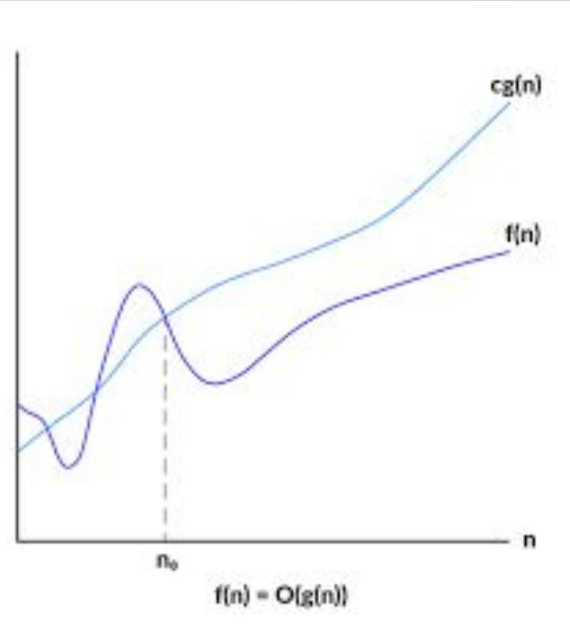
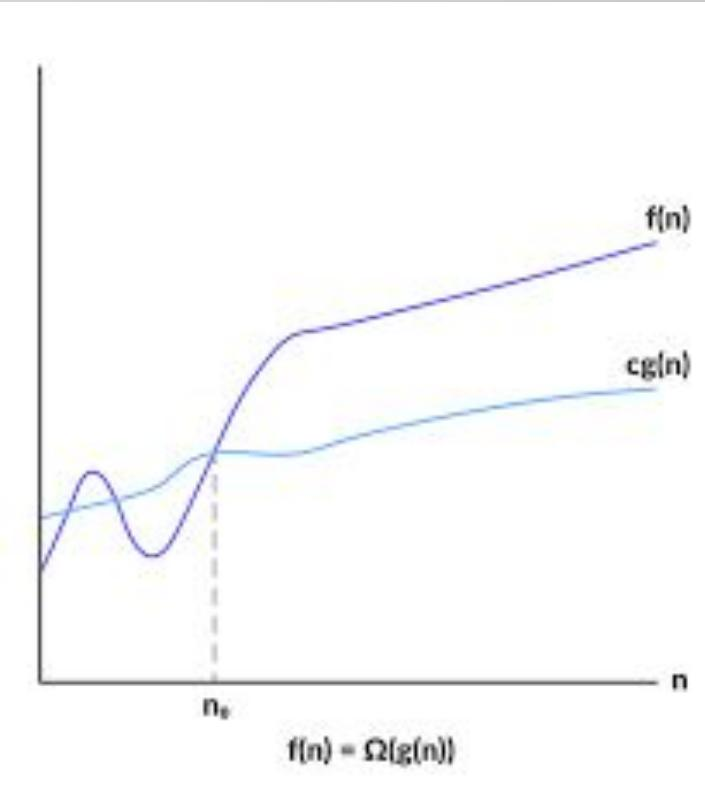
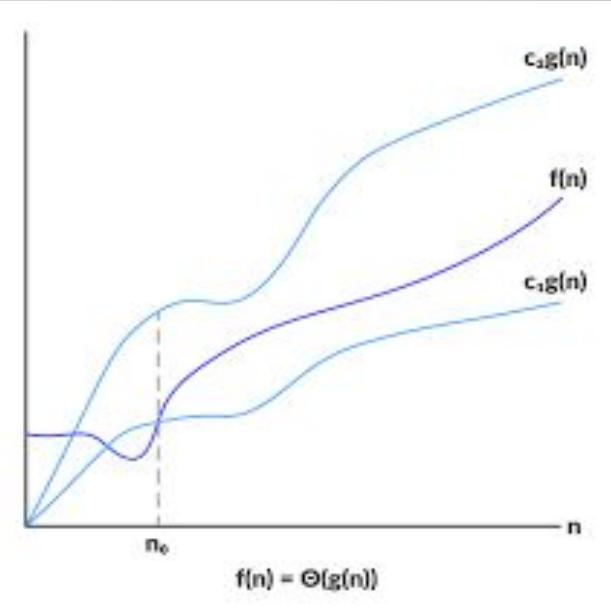

# Asymptotic Notations and Order of Growth

Used to evaluate the performance of algorithm based on input size

## Asymptotic Notations

### Big-O (O) – upper bound

Maximum time algorithm takes for its execution.

Let f(n), $\mathrm { { g } ( n ) }$ be two positive functions, then
$\operatorname { f } ( \mathbf { n } ) = \mathrm { O } ( \mathrm { g } ( \mathbf { n } ) ) { \mathrm { i } }$
iff There exist 2 constants c,n0 such that
${ \mathrm { f ( n ) } } \ll = { \mathrm { c } } ^ { * } { \mathrm { g ( n ) } }$
for all $\mathrm { n } > = \mathrm { n 0 }$ – ex: linear search complexity O(n)
–ex: let $\mathrm { f } ( \mathrm { n } ) = 3 \mathrm { n } { + } 2$ ,
$\mathrm { g } ( \mathrm { n } ) = \mathrm { n }$
${ \mathrm { f ( n ) } } \ll = { \mathrm { c } } ^ { * } \ { \mathrm { g ( n ) } }$
if $\mathrm { \Omega } _ { \mathrm { n } } { = } 1$ , $5 < = 4$ false 3n+2 <=
c\*n — – — let c=4 if $\mathrm { n } { = } 2$ , $8 < = 8$ true
$3 \mathrm { n } { + } 2 < = 4 { } ^ { \ast } \mathrm { n }$ if
$\mathrm { n } { = } 3$ , $1 1 \mathrm { ~ < = } 1 2$ true so, n0 should be
greater than 1 • Big- omega (Ω) – lower bound – minimum time algorithm takes for
its execution best case complexity let $\operatorname { f } ( \mathrm { n } )$ ,
$\mathrm { { g } ( n ) }$ be two positive functions, then
$\mathbf { f } ( \mathbf { n } ) = \Omega ( \mathbf { g } ( \mathbf { n } ) ) \mathrm { ~ }$
iff

There exist 2 constants c,n0 such that
$\operatorname { f } ( \mathbf { n } ) > = \mathbf { c } ^ { * } \operatorname { g } ( \mathbf { n } )$
for all $\mathrm { n } > = \mathrm { n 0 }$ – –ex: let
$\mathrm { f } ( \mathrm { n } ) = 3 \mathrm { n } { + } 2$ ,
$\mathrm { g } ( \mathrm { n } ) = \mathrm { n }$

$\operatorname { f } ( \mathbf { n } ) > = \mathbf { c } ^ { * } \operatorname { g } ( \mathbf { n } )$\
3n+2 >= c\*n — – — let c=1\
$3 \mathrm { n } { + } 2 > = 1 { } ^ { \ast } \mathrm { n }$

if $\mathrm { \bar { n } } { = } 1 , 5 { > } = 1$ true if
$\mathrm { n } { = } 2$ , $8 > = 2$ true

so, n0 should be greater than or equal to 1

### Big- theta $( \Theta )$ – tight bound

– average time algorithm takes for its execution – average case complexity – let
$\operatorname { f } ( \mathrm { n } )$ , $\mathrm { { g } ( n ) }$ be two
positive functions, then
$\operatorname { f } ( \mathbf { n } ) = \Theta ( \operatorname { g } ( \mathbf { n } ) ) ;$
iff

There exist 3 constants c1,c2,n0 such that
$\mathrm { c } 1 ^ { * } \mathrm { g } ( \mathrm { n } ) \mathrm { < = f ( n ) < = c } 2 ^ { * } \mathrm { g ( n ) }$
for all $\mathrm { n } > = \mathrm { n 0 }$ – –ex: let
$\mathrm { f } ( \mathrm { n } ) = 3 \mathrm { n } { + } 2$ ,
$\mathrm { g } ( \mathrm { n } ) = \mathrm { n }$
$\mathrm { c } 1 ^ { * } \mathrm { g } ( \mathrm { n } ) \mathrm { < = f ( n ) < = c } 2 ^ { * } \mathrm { g ( n ) }$
$\ln < = 3 \mathsf { n } + 2 < = 4 \mathsf { n } -- \mathsf { l e t } \mathsf { c } 1 = 1 , \mathsf { c } 2 = 4$
If $\mathrm { n 0 } { = } 1$ then $1 < = 5 < = 4 -$ – false If
$\mathrm { n } 0 { = } 2$ then $2 { < } = 8 { < } = 8 \ .$ – – true If
$\mathrm { n } 0 { = } 3$ then $3 { < } = 1 1 { < } = 1 2 \mathrm { ~ -- ~ }$
true so the condition is true from $\mathrm { n } 0 { = } 2$

### Little-o (o)

Let f(n), $\mathrm { { g } ( n ) }$ be two positive functions, then
$\operatorname { f } ( \mathbf { n } ) = \mathbf { o } ( \mathbf { g } ( \mathbf { n } ) )$
such that lim f(n) = 0 n→∞ g(n)

### Little omega (??)

let f(n), $\mathrm { { g } ( n ) }$ be two positive functions, then
$\mathbf { f } ( \mathbf { n } ) = \mathbf { \mathbf { 0 } } ( \mathbf { g } ( \mathbf { n } ) )$
such that lim g(n) = 0 or, n→∞ f(n)

$$
\operatorname* { l i m } _ { \mathfrak { n } \to \infty } \quad \begin{array} { l l } { { } } & { { \mathrm { f ( n ) ~ = \infty ~ } } } \\ { { \mathfrak { g } ( \mathfrak { n } ) } } \end{array}
$$

## Order of Growth

Rate at which the execution time of an algorithm increases based on increase in
input.

Order of growth : from smallest to largest :-

O (1) – constant arithmetic O (log n) – logarithmic – binary search (searching
elements in sorted array) O (n) – linear – linear search (searching elements in
unsorted array) O (n log n) – linear – merge sort (divide and conquer) O (n ) –
quadratic 2 bubble sort (comparing consecutive elemets) O ( n ) – cubic 3 matrix
multiplication (using 3 for loops) O (2 ) – exponential n tower of hanoi

## Properties

1. Transitivity
2. Reflexivity
3. Symmetry
4. Transpose symmetry
5. Trichotomy

### Transitivity

$\operatorname { f } ( \mathbf { n } ) = \Theta ( \operatorname { g } ( \mathbf { n } ) )$
and
$\operatorname { g } ( \mathfrak { n } ) = \Theta ( \mathrm { h } ( \mathfrak { n } ) ) \Rightarrow \operatorname { f } ( \mathfrak { n } ) = \Theta ( \mathrm { h } ( \mathfrak { n } ) )$
$\operatorname { f } ( \mathbf { n } ) = \Omega ( \operatorname { g } ( \mathbf { n } ) )$
and
$\mathrm { g } ( \mathrm { n } ) = \Omega ( \mathrm { h } ( \mathrm { n } ) ) \Longrightarrow \mathrm { f } ( \mathrm { n } ) = \Omega ( \mathrm { h } ( \mathrm { n } ) )$
${ \mathrm { f ( n ) } } = \mathrm { o ( g ( n ) ) } { \mathrm { ~ a n d ~ g ( n ) } } = \mathrm { o ( h ( n ) ) } \Rightarrow { \mathrm { f ( n ) } } = \mathrm { o ( h ( n ) ) }$
$\operatorname { f } ( \mathbf { n } ) = \omega ( \mathbf { g } ( \mathbf { n } ) )$
and
$\mathrm { g ( n ) } = \omega ( \mathrm { h ( n ) } ) \Rightarrow \mathrm { f ( n ) } = \omega ( \mathrm { h ( n ) } )$

### Reflexivity

$$
\begin{array} { r } { \mathbf { f } ( \mathrm { n } ) = \mathbf { O } ( \mathrm { f } ( \mathrm { n } ) ) } \\ { \mathbf { f } ( \mathrm { n } ) = { \boldsymbol { \Omega } } ( \mathrm { f } ( \mathrm { n } ) ) } \\ { \mathbf { f } ( \mathrm { n } ) = { \boldsymbol { \Theta } } ( \mathrm { f } ( \mathrm { n } ) ) } \end{array}
$$

### Symmetry

### Transpose symmetry

$$
\mathrm { f ( n ) } = \mathrm { o ( g ( n ) ) } \mathrm { i f f } \mathrm { g ( n ) } = \mathrm { \omega \mathrm { o ( f ( n ) ) } }
$$

### Trichotomy

for any 2 real numbers a and b, exactly one of the following must hold:

$$
\mathtt { a } < \mathtt { b } , \mathtt { a } = \mathtt { b } \ o r \mathtt { a } > \mathtt { b }
$$
