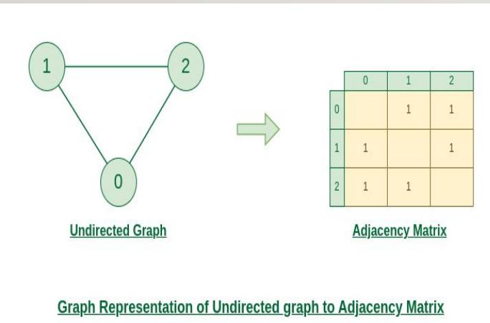
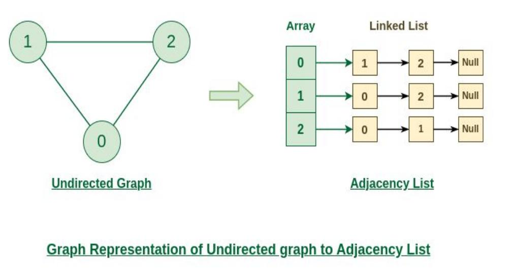
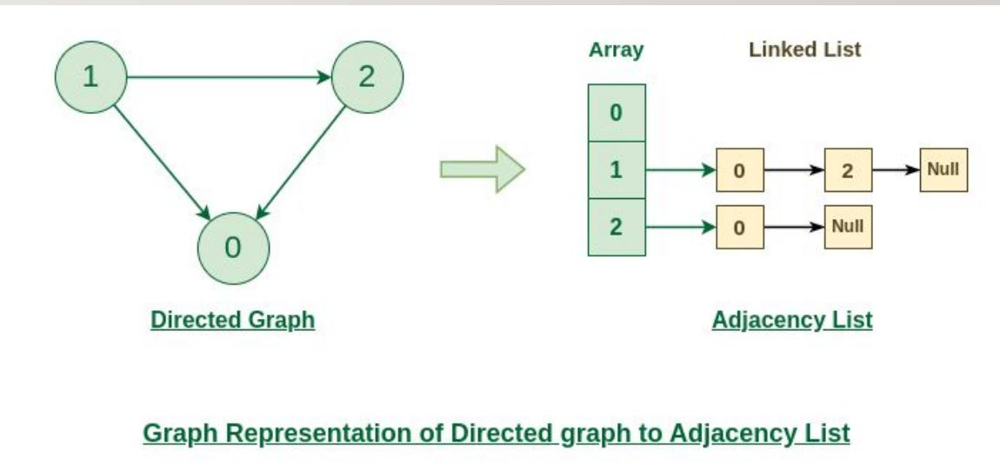
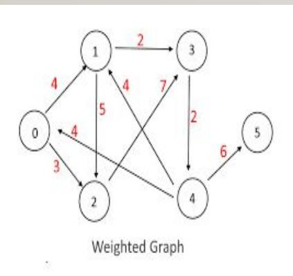
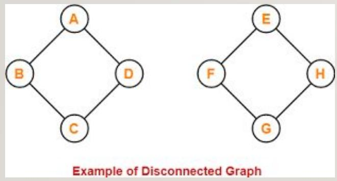
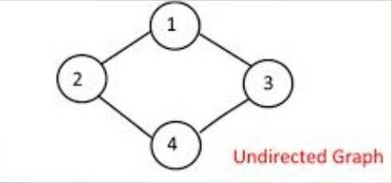
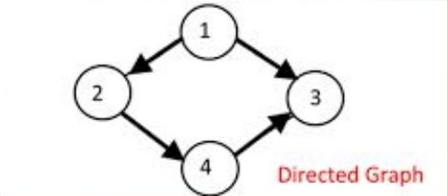
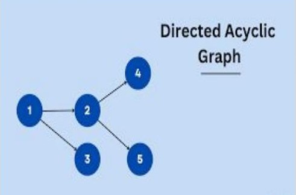
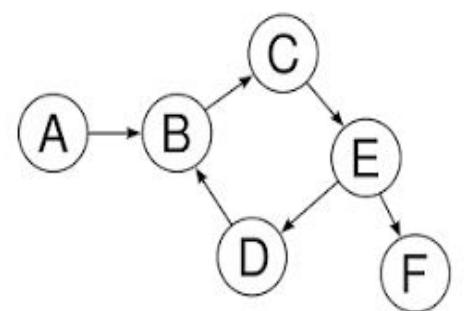

# Graph

- Graph is a non-linear data structure consisting of vertices and edges.
  $\mathrm { G } = ( \mathrm { V } , \mathrm { E } )$
- Two most common ways to represent a graph

1. Adjacency Matrix : representing a graph as a matrix of boolean (0's and 1’s)

If there is an edge from vertex i to j, mark adjMat[i][j] as 1.

If there is no edge from vertex i to j, mark adjMat[i][j] as 0.

2. Adjacency list : An array of Lists is used to store edges between two
   vertices.

Linked list

adjList[0] will have all the nodes which are connected (neighbour) to vertex 0.

adjList[1] will have all the nodes which are connected (neighbour) to vertex 1
and so on.

## Types of Graph

1. Directed graph $\longrightarrow$ directed edges only
2. Undirected graph $\longrightarrow$ undirected edges
3. Directed acyclic graph $\mathrm { ( D A G ) } \longrightarrow$ directed graph
   with no cycles
4. Cyclic graph $\longrightarrow$ directed graph with atleast 1 cycle
5. Weighted graph $\longrightarrow$ edges is having weight
6. Disconnected graph $\longrightarrow$ undirected graph that is not connected

