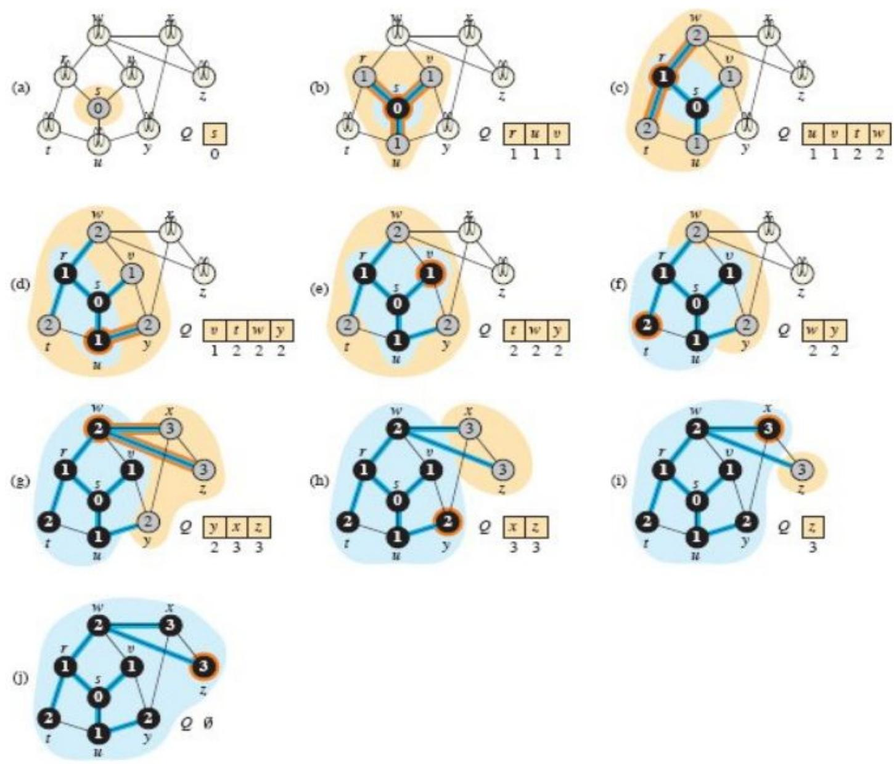

# Breadth First Search (BFS)

- Simplest algorithm for searching a graph.
- It begins with a node, then first traverses all its adjacent nodes.
- Once all adjacent are visited, then their adjacent are traversed.
- We mainly traverse vertices level by level.

$\operatorname { B F S } ( G , s )$\
I for each vertex $u \in G , V - \{ s \}$ 2 u.color $=$ WHITE\
3 $u . d = \infty$\
4 u.π NIL\
5s.color $=$ GRAY\
$6 s . d = 0$\
7s.π NIL\
8 $Q = \theta$\
9ENQUEUE(Q, s)\
10 while $\boldsymbol Q \neq \boldsymbol { \mathcal { O } }$\
11 $u = { \mathrm { D E Q U E U E } } ( \mathcal { Q } )$\
12 for each vertex $\nu$ in G.Adj[u]\
13 if v.color $= =$ WHITE\
14 v.color $=$ GRAY\
15 $\nu . d = u . d + 1$\
16 v.π = u ENQUEUEd(Q, ν)\
18 u.color $=$ BLACK

lI search the neighbors of $u$ $/ /$ is $\nu$ being discovered now?

$\nu$ is now on the frontier $u$ is now behind the frontier

## Analysis: Aggregate analysis

- After initialization, no vertex is whitened so each vertex is enqueued at most
  once, and dequeued at most once.
- Operations of enqueuing and dequeuing take O(1) time, and so the total time
  devoted to queue operations is O(V).
- because it scans the adjacency list of each vertex only when the vertex is
  dequeued, it scans each adjacency list at most once.
- The sum of the lengths of all adjacency lists is $\Theta ( \mathrm { E } )$ ,
  total time spent in scanning adjacency lists is
  $\mathrm { O } ( \mathrm { V } + \mathrm { E } )$ . The overhead for
  initialization is $\mathrm { O } ( \mathrm { V } )$ , and thus the total
  running time of the BFS procedure is
  $\mathrm { O } ( \mathrm { V } + \mathrm { E } )$ .
- Thus, breadth-first search runs in time linear in the size of the
  adjacency-list representation of G.

## Applications of BFS

Finding shortest path between two nodes Finding nodes in any connected component
of a graph Minimum spanning tree of unweighted graphs. Testing graphs for
bipartiteness
