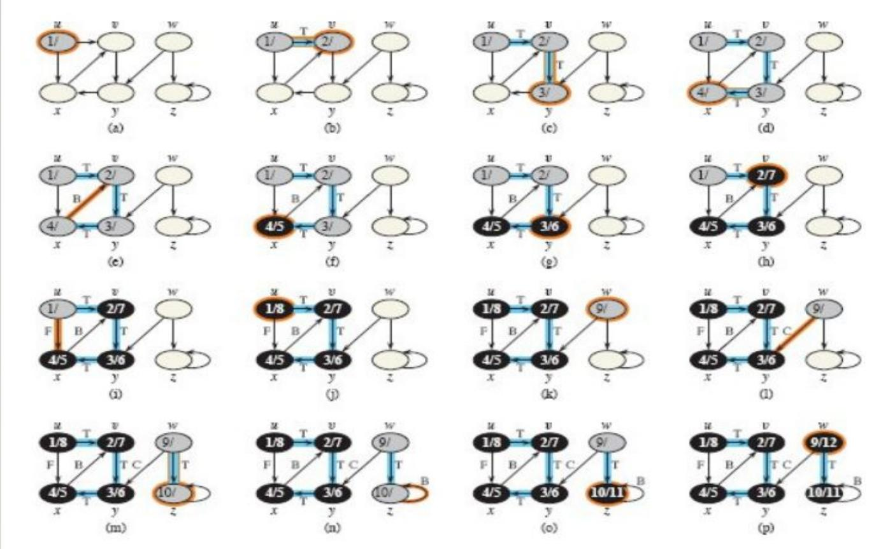
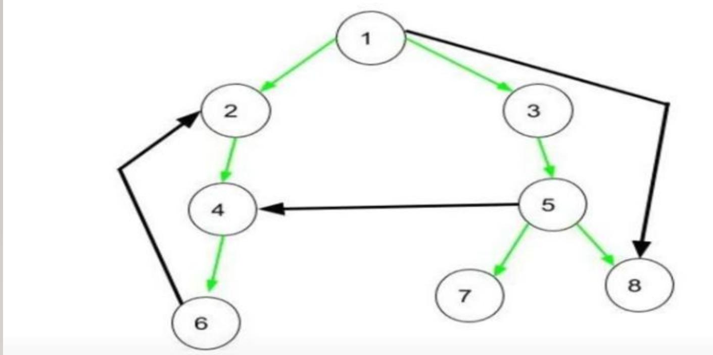
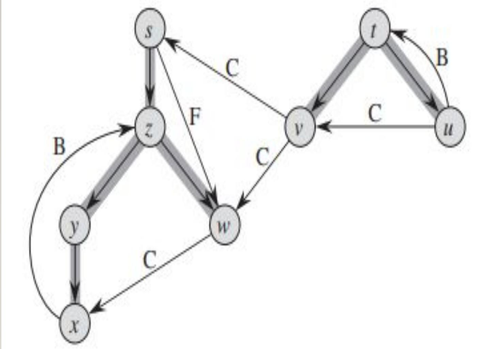

# Depth First Search (DFS)

- it searches “deeper” in the graph, backtrack to explore other branches.
- Used for: finding connected components, solving puzzles, topological sorting,
  cycle detection.

$\mathrm { D F S } ( G )$

I for each vertex $u \in G V$

u.color $=$ WHITE $u . \pi = \mathrm { N I L }$\
4 time $= 0$\
5for each vertex $u \in G V$

6 if u.color $= =$ WHITE\
7 DFS-VISIT $( G , u )$

$\mathrm { D F S - V I S I T } ( G , u )$\
l time $= t i m e + 1$ // white vertex $u$ has just been discovered\
2u. $d =$ time\
3u.color $=$ GRAY\
4for each vertex $\boldsymbol { \nu }$ in G. Adj[u]// explore each edge
$( u , \nu )$

if v.color $= =$ WHITE 6 $\nu . \pi = u$ DFS-VISIT(G, ν) 8 time = time + 1
$9 u . f =$ time 10u.color $=$ BLACK

## Complexity of DFS

Each vertex is visited utmost once, so O (V) time Each adjacency list is scanned
utmost once, so O (E) time Time complexity of
$\mathrm { D F S } = \mathrm { O } \left( \mathrm { V } + \mathrm { E } \right)$

## Applications of DFS

Finding connected components in graph Topological sorting in DAG Scheduling
problems Cycle detection in graphs Finding bridges of a graph

Classification of edges in DFS:

1. Tree edges $\longrightarrow$ edge in tree obtained after applying DFS
2. Back edges $\longrightarrow$ edge (u,v) such that v is descendant but not
   part of DFS tree $\longrightarrow$ self loops are considered to be back
   edges.
3. Forward edges $\longrightarrow$ edge (u,v) such that v is ancestor but not
   part of DFS tree
4. Cross edges $\longrightarrow$ edge which connects 2 nodes such that they do
   not have any ancestor and descendant relationship between them

Ex:

DFS : 1 2 4 6 3 5 7 8

Tree edges : (1,2), (2,4), (4,6), (1,3), (3,5), (5,7), (5,8)

Forward edges: (1,8)

Backward edges: (6,2)

Cross edges: (5,4)

Perform DFS and find the following edges: tree edges, forward edges, backward
edges, cross edges.

