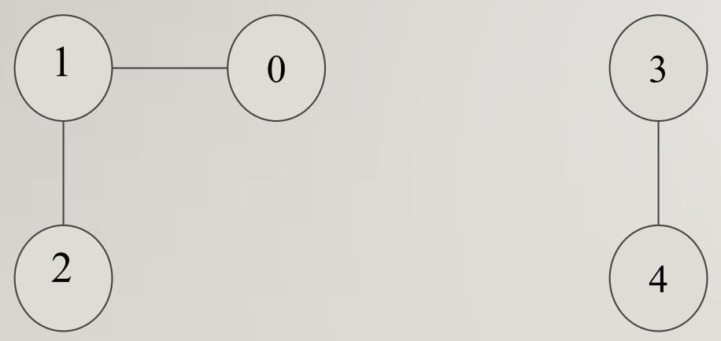
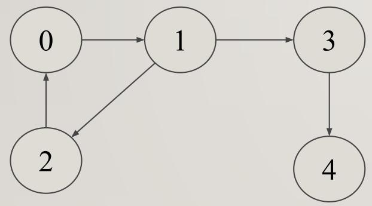

# Connected Components

- Connected component of a graph G is a connected subgraph of G of maximum size.
- A graph may have more than one connected components

## Strongly Connected Components

- Application of DFS. Decomposing a directed graph into its strongly connected
  components.
- After decomposition, the algorithm is run separately on each strongly
  connected component
- The solutions are then combined according to the structure of connections
  between components
- Ex: there are 3 SCC : {0,1,2}, {3}, {4}

$\mathrm { V } 0 \Longrightarrow \mathrm { V } 0 { \longrightarrow } \mathrm { V } 1 { \longrightarrow } \mathrm { V } 2 { \longrightarrow } \mathrm { V } 0$
$\mathrm { V } 1 \Rightarrow \mathrm { V } 1 {  } \mathrm { V } 2 {  } \mathrm { V } 0 {  } \mathrm { V } 1$
V2 ⇒ V2→V0→V1→V2

### Algorithm

1. call $\mathrm { D F S } ( G )$ to compute finish times $u . f$ for each
   vertex u
2. create $G ^ { \mathrm { T } }$
3. call $\mathrm { D F S } ( G ^ { \mathrm { T } } )$ , but in the main loop of
   DFS, consider the vertices in order of decreasing $u . f$ (as computed in
   line 1)
4. output the vertices of each tree in the depth-first forest formed in line 3
   as a separate strongly connected component

### Time Complexity

Time complexity of scc is;

$$
\mathrm { S C C } = \mathrm { O } ( \mathrm { V } + \mathrm { E } )
$$

### Applications

In social networks, a group of people are generally strongly connected (For
example, students of a class or any other common place). Many people in these
groups generally like some common pages or play common games. The SCC algorithms
can be used to find such groups and suggest the commonly liked pages or games to
the people in the group.
