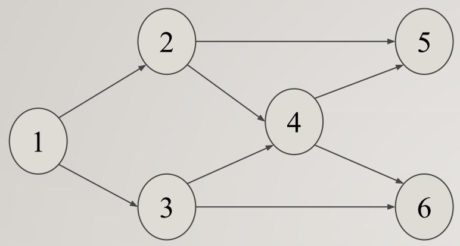
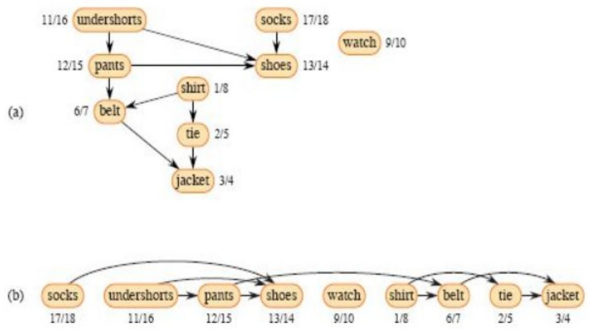

# Directed Acyclic Graphs & Topological Ordering

- a graph where all edges have a direction (directed) and there are no cycles
  (acyclic).
- A topological sort of a dag
  $\mathrm { G } = ( \mathrm { V } , \mathrm { E } )$ is a linear ordering of
  all its vertices such that if G contains an edge (u, v), then u appear before
  v in the ordering.
- Topological sorting is defined only on directed graphs that are acyclic; no
  linear ordering is possible when a directed graph contains a cycle.
- A topological sort of a graph is an ordering of its vertices along a
  horizontal line so that all directed edges go from left to right.

Ex:

Topological sort : {1,2,3,4,5,6}

## Algorithm

### TOPOLOGICAL-SORT $( G )$

1. call $\mathrm { D F S } ( G )$ to compute finish times $\nu . f$ for each
   vertex $\nu$
2. as each vertex is finished, insert it onto the front of a linked list
3. return the linked list of vertices

## Complexity

- Suppose |E| is the number of edges and $| \mathrm { V } |$ is the number of
  nodes of the graph G.
- Time to determine the indegree for each node $= \mathrm { O ( E ) }$ time.
  This involves looking at each directed edge in the graph once.
- Time to determine the nodes with no incoming edges $= \mathrm { O ( V ) }$
  time
- Add nodes until we run out of nodes with no incoming edges. This loop could
  run once for every node—O(V) times
  - Constant-time operations to add a node to the topological ordering.
  - Decrement the indegree for each neighbor of the node we added. Over the
    entire algorithm, we'll end up doing exactly one decrement for each edge,
    making this step O(E) time.

All together, the time complexity is
$\mathrm { O } ( \mathrm { V } { + } \mathrm { E } )$

## Applications

- Scheduling jobs from the given dependencies among jobs
- Instruction Scheduling
- Determining the order of compilation tasks to perform in makefiles
- Data Serialization

(a) Professor Bumstead topologically sorts his clothing when getting dressed.
Each directed edge (u, v) means that garment $u$ must be put on before garment
v. The discovery and finish times from a depth-first search are shown next to
each vertex.

(b) The same graph shown topologically sorted, with its vertices arranged from
left to right in order of decreasing finish time. All directed edges go from
left to right.
