# Balanced Binary Search Trees - AVL Tree

AVL Tree is invented by GM Adelson - Velsky and EM Landis in 1962. The tree is
named AVL in honour of its inventors. An AVL tree is a self-balancing binary
search tree that maintains a balanced structure through rotations to ensure
efficient search, insertion, and deletion operations. OR Tree can be defined as
height balanced binary search tree in which each node is associated with a
balance factor.

## Balance Factor

Balance Factor of a node $=$ height of left subtree – height of right subtree.
In an AVL tree balance factor of every node is -1,0 or $+ 1$. Otherwise the tree
will be unbalanced and need to be balanced. Characteristic of an AVL tree is
that for every node, the difference in height between its left and right
subtrees is at most one.

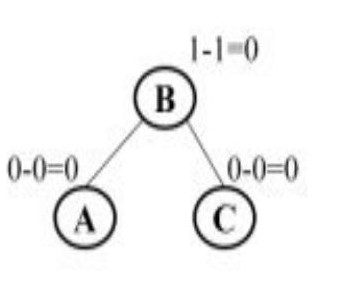

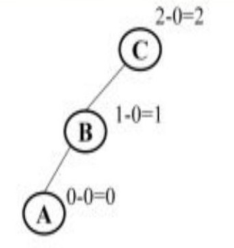

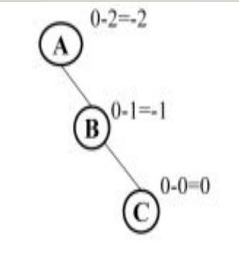

## Why AVL Tree?

- Most of the Binary Search Tree (BST) operations (eg: search, insertion,
  deletion etc) take O(h) time where h is the height of the BST.
- The minimum height of the BST is log n
- The height of an AVL tree is always O(log n) where n is the number of nodes in
  the tree. So the time complexity of all AVL tree operations are O(log n)
- An AVL tree becomes imbalanced due to some insertion or deletion operations.
- We use rotation operation to make the tree balanced.

## 4 Types of Rotations

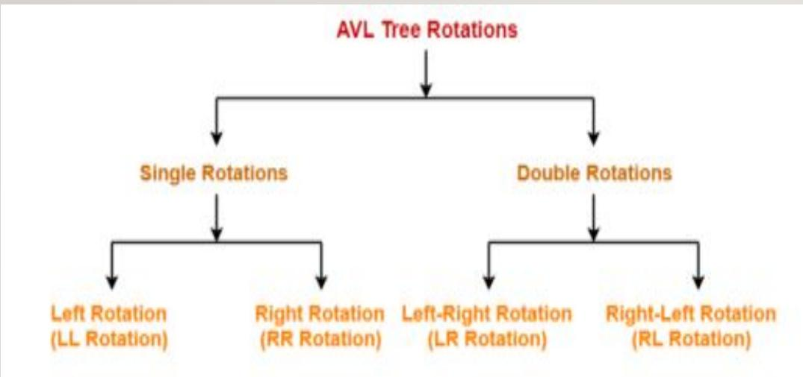

### LL Rotation

- Single **right** rotation
- This rotation is performed when a new node is inserted to the left child of
  left subtree

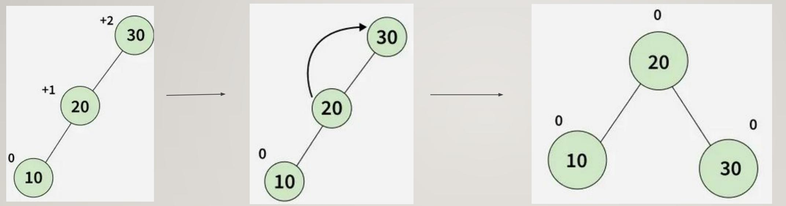

### RR Rotation

- Single **left** rotation
- This rotation is performed when a new node is inserted to the left child of
  left subtree

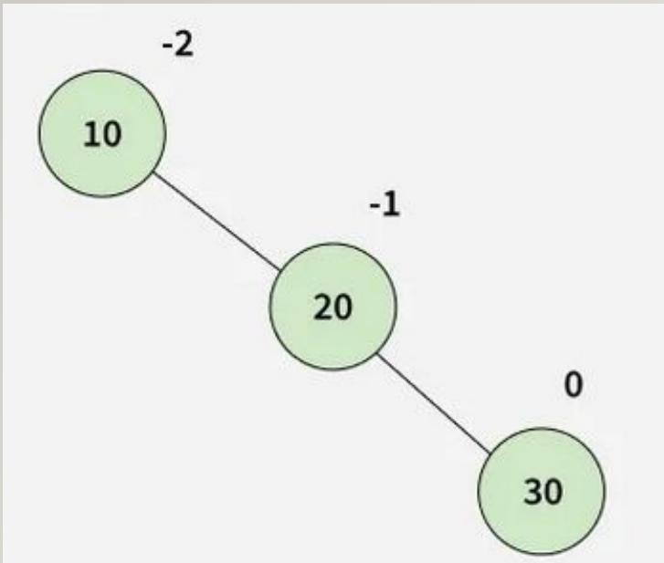

### Left-Right Rotation (LR Rotation)

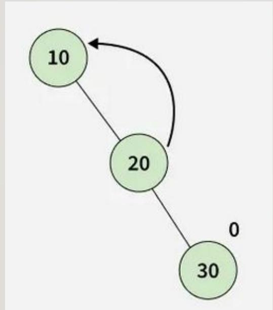

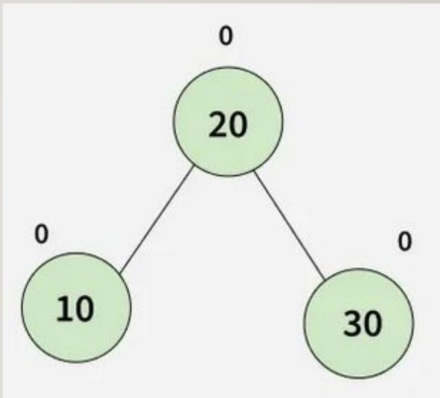

The LR rotation is the combination of single left rotation followed by single
right rotation.

### Left-Right Rotation (LR Rotation)

- Double rotation
- The LR rotation is the combination of single left rotation followed by single
  right rotation.
- i.e; Perform a left rotation on the left child, followed by a right rotation
  on the node.

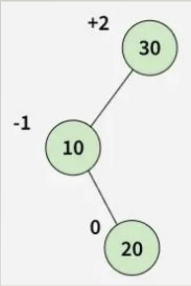

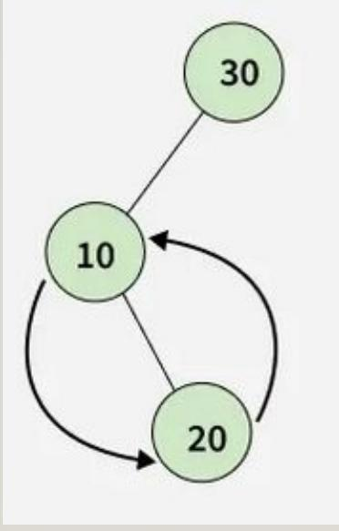

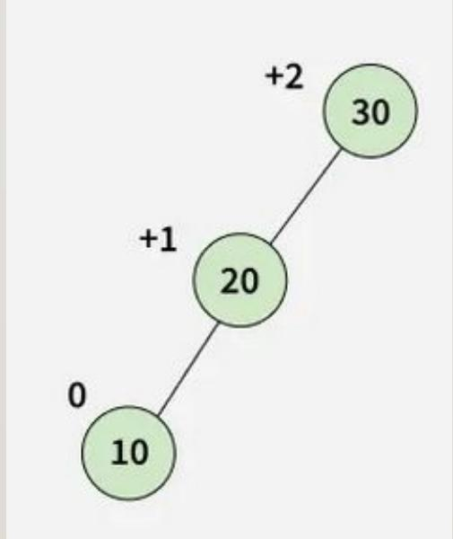

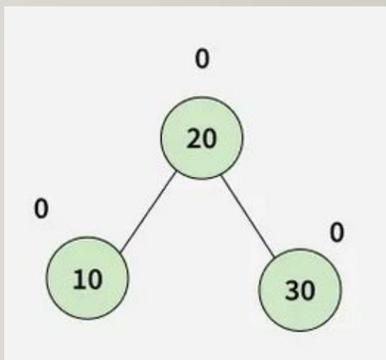

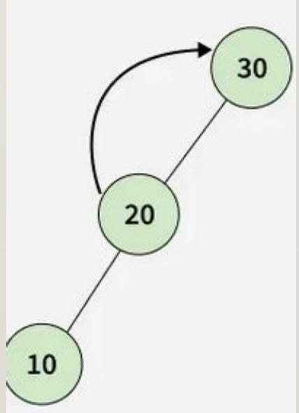

### Right-Left Rotation(RL Rotation)

- Double rotation
- The RL rotation is the combination of single right rotation followed by single
  left rotation.
- i.e; Perform a right rotation on the right child, followed by a left rotation
  on the node.

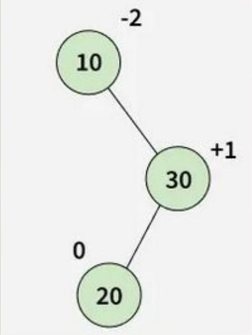

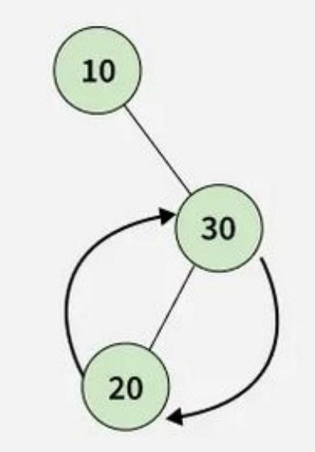

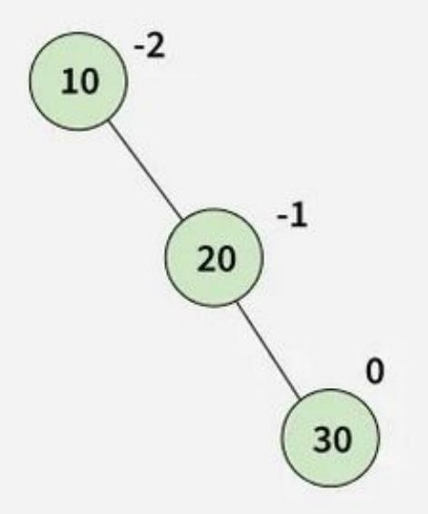

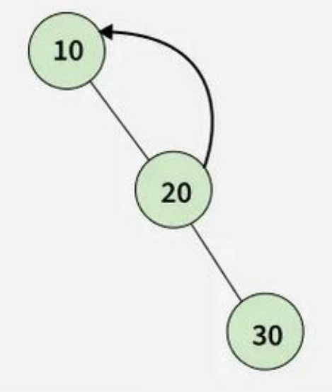

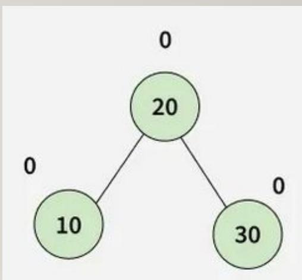

## AVL Tree Insertion Algorithm

1. Insert the node as the leaf node. Use BST insertion procedure
2. After insertion check the balance factor of every node
3. If the tree is imbalanced, perform the suitable rotation. Let z be the newly
   inserted node. X be the first unbalanced node on the path from z to root. y
   be the child of x on the path from z to root
   - If y is the left child of x and $\mathbf { Z }$ is in the left subtree of
     y, then perform RR Rotation with respect to x.
   - If y is the right child of x and $\mathbf { Z }$ is in the right subtree of
     y, then perform LL Rotation with respect to x
   - If y is the left child of x and $\mathbf { Z }$ is in the right subtree of
     y, then perform LR Rotation
   - If y is the right child of x and $\mathbf { Z }$ is in the left subtree of
     y, then perform RL Rotation

Complexity of AVL tree insertion
$= { \mathrm { O } } ( \log { \mathfrak { n } } )$

Where log n is the height of the tree.

Example:

Insert 14,17,11,7,53,4 and 13 in to an empty AVL tree

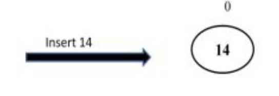

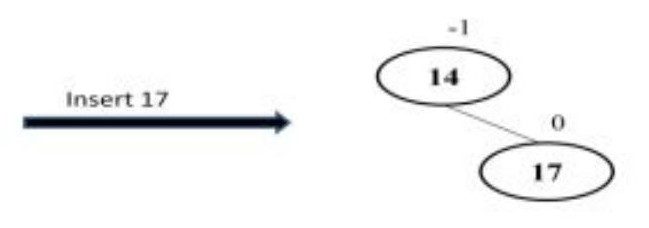

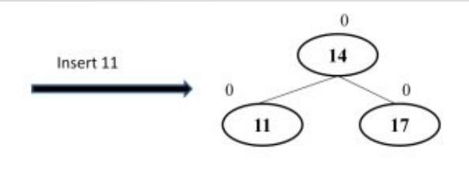

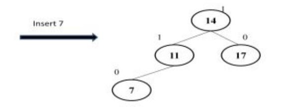

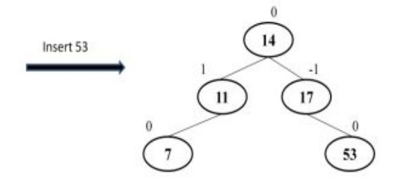

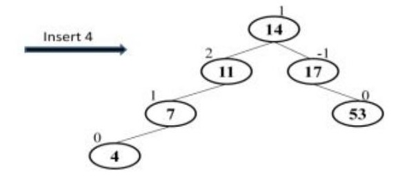

The tree is now imbalanced because the balance factor of node 11 is 2. Perform
RR Rotation with respect to 11

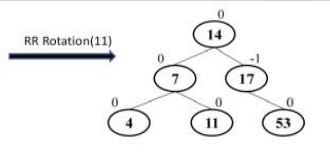

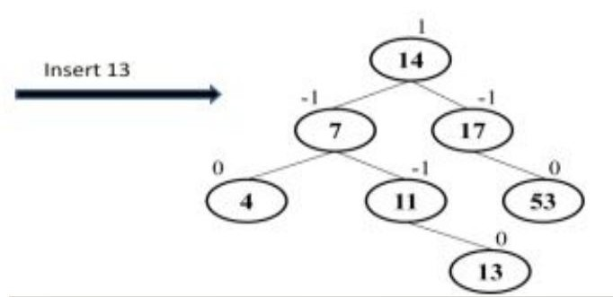

## AVL Tree Deletion Algorithm

Let w be the node to be deleted

1. Delete w using BST deletion procedure
2. Starting from w, travel up and find the first unbalanced node. Let x be the
   first unbalanced node.
3. If balance factor $( \mathbf { \boldsymbol { x } } ) { > } 1$ then
   y=leftchild(x)
4. Else y=rightchild(x)
5. If y is the left child of x
   1. If balance factor $( \mathrm { y } ) { \ge } 0$ then $z { = }$
      leftchild(y)
   2. Else $z { = }$ rightchild(y)
6. Else
   1. If balance factor $( \mathrm { y } ) \leq 0$ then $z { = }$ rightchild(y)
   2. Else $z { = }$ leftchild(y)
7. If y is the left child of x and $\mathbf { Z }$ is the left child of y, then
   perform RR Rotation with respect to x
8. If y is the right child of x and $\mathbf { Z }$ is the right child of y,
   then perform LL Rotation with respect to x
9. If y is the left child of x and $\mathbf { Z }$ is the right child of y, then
   perform LR Rotation with respect to x
10. If y is the right child of x and $\mathbf { Z }$ is the left child of y,
    then perform RL Rotation with respect to x

Complexity of AVL tree deletion $= \mathrm { O } ( \log { \mathfrak { n } } )$

Where log n is the height of the tree.

Example:

Delete 20 from the given AVL Tree

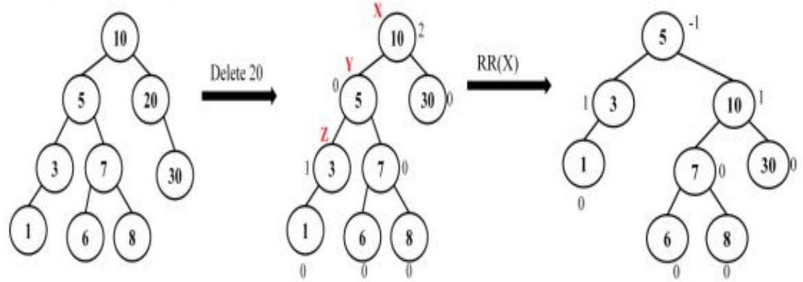
